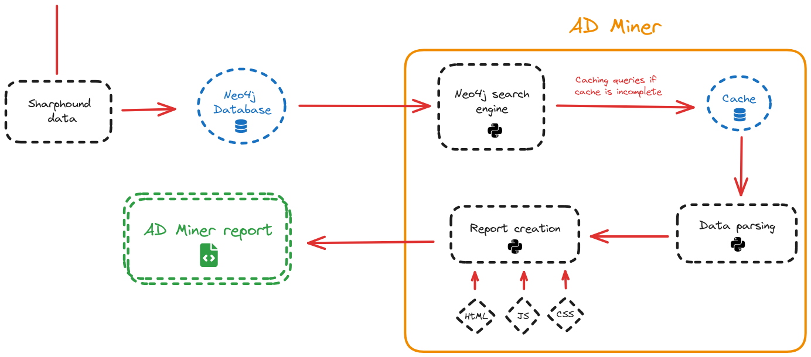

# Contributing ? 

> :warning: Before contributing, please note that commit messages **MUST** follow conventional rules as stated [here](https://gist.github.com/qoomon/5dfcdf8eec66a051ecd85625518cfd13). 

## 1. General Description 🔧

AD Miner is a set of scripts that plug into an already-populated graph database containing data imported with Bloodhound. The purpose of AD Miner is to produce readable reports for all types of users, including non-technical individuals. This imposes certain constraints:

- Reports readable on any OS
- Requires no technical knowledge
- No reliance on external software

The design that was chosen consists in producing reports using static HTML that can be interpreted by any web browser.
Below is a summary diagram of how AD Miner works.



AD Miner is coded in Python. To generate the HTML report, queries are made to the Neo4j database, and the result is parsed and added to HTML and JavaScript templates to generate the various report pages. To save time and resources, the result of Neo4j queries is stored in cache files.


### 2. Cluster logic 🔎

#### Initial Graph Rendering

##### Definition of Global Variables

- In the first run, we take the hardcoded data containing the entire graph's data and create 2 global variables that will serve as reference variables for all subsequent renders.

```js
const nodesdeepcopy = new vis.DataSet(data_nodes);
const edgesdeepcopy = new vis.DataSet(data_edges);
allNodescopy = nodesdeepcopy.get({returnType:"Object"});
```

##### Cluster Marking

- We mark nodes that will serve as cluster cores according to the defined rules:

```js
// Cluster nodes with more than 3 lone direct children (and cluster only these children)
markClustersPartial(3);

// Cluster all nodes with more than 100 direct children (then cluster all children recursively)
markClusters(100);

// Cluster nodes that are OUs and that have more than 3 direct children that are ending nodes
markClustersForward(3);
```

- Each of the `markClustersXXXX` functions (note, Clusters in plural) sets a clusterType attribute on eligible cluster cores by calling a `markClusterXXXX` function (note, Cluster in singular) for each of the relevant nodes.
- A `clusterChildren` attribute, which is an Array containing the cluster's children, is defined.

There are 3 types of clusters: complete, partial, and forward: 

- complete: aggregates all children of the cluster core recursively.

- partial: aggregates the direct children of the cluster core, if they have no children themselves and are neither incoming nor outgoing nodes.

- forward: aggregates the direct parents of the cluster core, if they are end nodes and if the cluster core is an OU.

##### Subgraph Calculation
We use the `getSubnet()` function: it retrieves all nodes that have been marked as clusters and removes all nodes in their clusterChildren attributes. Additionally, it removes all incoming or outgoing edges of the aggregated nodes.

```js
var subnetTuple = getSubnet();
var subnodes = subnetTuple[0];
var subedges = subnetTuple[1];
```


##### Graph Rendering
Using the data calculated in the `getSubnet()` function, we can create the graph that will ultimately be rendered.


```js
var nodes = new vis.DataSet(Object.values(subnodes));
var edges = new vis.DataSet(Object.values(subedges));

var nodesView = new vis.DataView(nodes);
var edgesView = new vis.DataView(edges);

startNetwork({ nodes: nodesView, edges: edgesView }, options);
network.fit();
```

The `startNetwork` function takes care of: creating the global variables `allNodes` and `allEdges`, which correspond to the arrays of nodes/edges rendered in the graph and are referenced regularly in the code. It also launches the `nodes_positioning()` function, which positions the nodes using dagre.js.

```js
function startNetwork(data, opts)
{
const container = document.getElementById("mynetwork");

// assigning undeclared variables makes them global :))
network = new vis.Network(container, data, opts);
allNodes = nodes.get({ returnType: "Object" });
allEdges = edges.get({ returnType: "Object" });

..............

nodes_positioning();
}
```


The `dagrePositioning` function defines two global variables, `computedHorizGraph` and `computedVertGraph`, which indicate whether the graph layout has already been calculated, preventing it from being recalculated each time the layout (horizontal/vertical) changes.

#### Subsequent Graph Renders
##### Opening a Cluster
The `openCluster` function is common to all three types of clusters.

It calls the `unmarkCluster` function, which marks the node as non-cluster. It then resets the global variables `computedHorizGraph` and `computedVertGraph` to ensure that positions are recalculated. Finally, it calls the `updateGraph` function.

```js
function openCluster(nodeId) {
.......
unmarkCluster(nodeId);
    window.computedHorizGraph = false;
    window.computedVertGraph = false;
    updateGraph({"context": "open_cluster", "nodeId": nodeId});
}
```

The `updateGraph` function calculates the new subgraph to display by calling `getSubnet()` and then displays it by calling `startNetwork()`.

```js
function updateGraph(info){
    subnetTuple = getSubnet();
    subnodes = subnetTuple[0];
    subedges = subnetTuple[1];

    nodes = new vis.DataSet(Object.values(subnodes));
    edges = new vis.DataSet(Object.values(subedges));

    nodesView = new vis.DataView(nodes);
    edgesView = new vis.DataView(edges);

    const x = network.getViewPosition().x;
    const y = network.getViewPosition().y;

    const scale = network.getScale();
    startNetwork({ nodes: nodesView, edges: edgesView }, options);

 ...........
}
```

##### Closing a Cluster

To close (create) a cluster, we use the `closeClusterXXXX` functions (note, Cluster in singular) which mark a node as a cluster, and then update the graph as when a cluster is opened.

### 3. Rating logic 🏆

- Note stating that the result might depend on the enabled/disabled controls, and that only a complete scan gives a good overview.

- Note from 1 to 5 (same as ANSSI: https://www.cert.ssi.gouv.fr/uploads/guide-ad.html)
  1 The Active Directory directory service has critical configuration issues that immediately jeopardize all hosted resources. Corrective actions must be taken as soon as possible;
  2 The Active Directory directory service has configuration and management deficiencies sufficient to jeopardize all hosted resources. Corrective actions must be taken in the short term;
  3 The Active Directory directory service has a basic security level that has not been weakened since its installation;
  4 The Active Directory directory service has a good level of security;
  5 The Active Directory directory service has a security level at the state of the art.

-> NOTE = min(criticity of found vulnerabilities == weakest link)

- 1 Overall score
- 1 sub-score per domain
- 1 score per vulnerability

Dashboard that allows you to see:
- the final score
- the exposures (scores) of different domains
- the vulnerabilities found

- Group controls together


### 4. Shortest Path Search Logic and Highlighting 🎯

- function `pathHighlight(selectedNode)`

 It is a Breadth-first search (https://en.wikipedia.org/wiki/Breadth-first_search) of the graph to find a path with the minimum of nodes towards the end of the graph. The function takes a node as input and returns an array containing the IDs of the nodes forming an optimal path towards the end. If multiple optimal paths are possible, the function returns the first one it finds.


