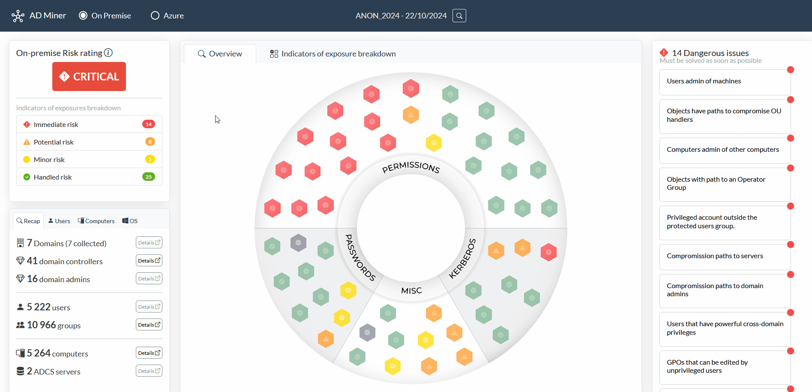
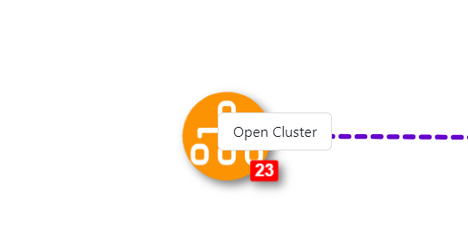

<div align="center">

# AD Miner #

<br>
</div>

<div align="center">
    <a target="_blank" rel="noopener noreferrer" href="https://github.com/Mazars-Tech/AD_Miner/releases" title="Latest AD_Miner release">
        </a>
    <a target="_blank" rel="noopener noreferrer" href="https://github.com/Mazars-Tech/AD_Miner/commits/main" title="Latest release">
        </a>
    <a target="_blank" rel="noopener noreferrer" href="https://github.com/Mazars-Tech/AD_Miner/commits/dev" title="Latest commit in dev">
        </a>
    <a target="_blank" rel="noopener noreferrer" href="https://inventory.raw.pm/tools.html#ADMiner" title="Rawsec's CyberSecurity Inventory">
        </a>

<br>

<a href="https://discord.gg/invite/5Hpj4Gs5SS">
  
</a>

</div>

</b>


### AD Miner is an Active Directory (on-premise and Entra ID) auditing tool that: ###

- Leverages **Cypher queries** to analyze data from the [BloodHound](https://github.com/SpecterOps/BloodHound) graph database (Neo4j).
- Provides a comprehensive overview of existing weaknesses through a static, web-based report.

Web-based reports features:
- **Detailed listings** of identified weaknesses
- **Dynamic graphs** for visual analysis
- **Historical key indicators** to track changes over time
- **Risk ratings** to prioritize threats and actions

## Quick overview of a report ##

### Comprehensive Mitigation Paths for Active Directory Risks ###
A risk-based rating of Active Directory weaknesses, along with comprehensive mitigation paths.

<p align="center">
  
</p>

### A dynamic web interface ###
Search bar and controls that are carefully tailored to identify the most risky misconfigurations.

<p align="center">
  
</p>

### Progress Monitoring through an Evolving Interface ###
You can also observe indicators over time to help measuring mitigation efficiency.

<p align="center">
  
</p>

## Prerequisites

To run AD Miner, you first need a neo4j database which contains the Active Directory objects:

 1. To extract the data from the domain, you can use tools like [SharpHound](https://github.com/BloodHoundAD/SharpHound), [RustHound-CE](https://github.com/g0h4n/RustHound-CE) or [BloodHound.py](https://github.com/dirkjanm/BloodHound.py) and [AzureHound](https://github.com/BloodHoundAD/AzureHound) for EntraID environments.
> [!CAUTION]
> We strongly recommend using [BloodHound Automation](https://github.com/Tanguy-Boisset/bloodhound-automation), as it installs the Graph Data Science Neo4j plugin, which significantly improves computation time and overall performance.
</div>

 2. To set up your BloodHound environment (including the GUI and Neo4j database), [BloodHound Automation](https://github.com/Tanguy-Boisset/bloodhound-automation) is **highly recommended due to its seamless integration with the Graph Data Science plugin**. Though it is perfectly fine to use the default [BloodHound CE](https://github.com/SpecterOps/BloodHound) installation, be aware that you will miss out on the benefits of GDS (e.g., smarter pathfinding, improved execution speed, etc.).
 
 4. By default, BloodHound creates a neo4j base accessible on port 7687.

## Installation and setup ##

The easier way is to do the following command using `pipx`:
```shell
pipx install 'git+https://github.com/Mazars-Tech/AD_Miner.git'
```

ADMiner is also available on some Linux distributions:

[](https://repology.org/project/ad-miner/versions)

- BlackArch: `pacman -S ad-miner`
- NixOS: `nix-env -iA nixos.ad-miner`

## Usage ##

Run the tool:

    AD-miner [-h] [-b BOLT] [-u USERNAME] [-p PASSWORD] [-e EXTRACT_DATE] [-r RENEWAL_PASSWORD] [-a] [-c] [-l LEVEL] -cf CACHE_PREFIX [-ch NB_CHUNKS] [-co NB_CORES] [--rdp] [--evolution EVOLUTION] [--cluster CLUSTER]

Example:

    AD-miner -cf My_Report -u neo4j -p mypassword

Cache files are generated at the completion of each Neo4j request. This feature allows you to pause or stop AD Miner at any point during its process without losing previously computed results. To leverage the cache, use the `-c` parameter. The cache files are stored in the cache_neo4j folder in your current repository. For the cache to be used, the report name must match the cache file's name prefix :

    AD-miner -c -cf My_Report -u neo4j -p mypassword

To better handle large data sets, it is possible to enable multi-threading and also to use a cluster of neo4j databases, as shown in the following example (where server1 handles 32 threads and server2 handles 16) :

    AD-miner -c -cf My_Report -b bolt://server1:7687 -u neo4j -p mypassword  --cluster server1:7687:32,server2:7687:16

If password renewal policy is known, you can specify it using the `-r` parameter to ensure that password renewal controls align with your environment's settings (default is 90 days). For example, if the password policy is set to 180 days, you can use the following:

    AD-miner -c -cf My_Report -b bolt://server1:7687 -u neo4j -p mypassword -r 180
    
> [!TIP]
> The default password of the Bloodhound CE neo4j database is `bloodhoundcommunityedition` or `neo5j` if you use [BloodHound Automation](https://github.com/Tanguy-Boisset/bloodhound-automation)

Options:

      -h, --help            show this help message and exit
      -b BOLT, --bolt BOLT  Neo4j bolt connection (default: bolt://127.0.0.1:7687)
      -u USERNAME, --username USERNAME
                            Neo4j username (default : neo4j)
      -p PASSWORD, --password PASSWORD
                            Neo4j password (default : bloodhoundcommunityedition)
      -e EXTRACT_DATE, --extract_date EXTRACT_DATE
                            Extract date (e.g., 20220131). Default: last logon date
      -r RENEWAL_PASSWORD, --renewal_password RENEWAL_PASSWORD
                            Password renewal policy in days. Default: 90
      -c, --cache           Use local file for neo4j data
      -l LEVEL, --level LEVEL
                            Recursive level for path queries
      -cf CACHE_PREFIX, --cache_prefix CACHE_PREFIX
                            Cache file to use (in case of multiple company cache files)
      --gpo_low             Perform a faster but incomplete query for GPO (faster than the regular query)
      -ch NB_CHUNKS, --nb_chunks NB_CHUNKS
                            Number of chunks for parallel neo4j requests. Default : 20 * number of CPU
      -co NB_CORES, --nb_cores NB_CORES
                            Number of cores for parallel neo4j requests. Default : number of CPU
      --rdp                 Include the CanRDP edge in graphs
      --evolution EVOLUTION
                            Evolution over time : location of json data files. ex : '../../tests/'
      --cluster CLUSTER     Nodes of the cluster to run parallel neo4j queries. ex : host1:port1:nCore1,host2:port2:nCore2,...

In the graph pages, you can right-click on the graph nodes to cluster them or to open the cluster.

<p align="center">
    
</p>

## Evolution ##

If you have multiple AD-Miner reports over time, you can easily track the evolution with the `--evolution` argument: each AD-Miner report generates a JSON data file alongside the `index.html` file. You just need to gather these different JSON files into a single folder and specify the path to that folder after the `--evolution` argument.

A tab called 'Evolution over time'  then appears on the main page.

<p align="center">
    
</p>

Also, views by categories 'permissions,' 'passwords,' 'kerberos' also allow you to track changes over time.

<p align="center">
    
</p>

## Smartest paths ##

AD Miner can compute paths based on their actual exploitability. Indeed, sometimes the shortest path is difficult to exploit (here because of the `ExecuteDCOM` before the `HasSession`).

<p align="center">
    
</p>

While a longer but simpler path exists (here with `MemberOf` and `AdminTo` instead of `ExecuteDCOM`).

<p align="center">
    
</p>

AD Miner automatically switches to smartest path mode when your neo4j database has the Graph Data Science plugin installed (https://neo4j.com/docs/graph-data-science/current/).
The easiest way to install this plugin is to define an environment variable in your neo4j docker: ```NEO4J_PLUGINS=["graph-data-science"]``` (it is by default installed with [BloodHound Automation](https://github.com/Tanguy-Boisset/bloodhound-automation)).

Currently, 10 controls utilize full graph coverage and optimize the smartest paths for analysis.

## Implemented controls ##

The following provides a list controls that have already been implemented in AD Miner :

### Controls for On-premise ###

| **Category**    | **Description**                                    |                | **Category**    | **Description**                                    |
|-----------------|----------------------------------------------------|----------------|-----------------|----------------------------------------------------|
| **Kerberos**    | AS-REP Roastable accounts                          |                | **Misc**        | Computers with obsolete OS                         |
| **Kerberos**    | Kerberoastable accounts                            |                | **Misc**        | Dormant accounts                                   |
| **Kerberos**    | Kerberos constrained delegation                    |                | **Misc**        | Functional level of the domain                     |
| **Kerberos**    | Kerberos RBCD against computers                    |                | **Misc**        | Ghost computers                                    |
| **Kerberos**    | Kerberos unconstrained delegations                 |                | **Misc**        | Groups without any member                          |
| **Kerberos**    | Old KRBTGT password                                |                | **Misc**        | OUs without any member                             |
| **Kerberos**    | Shadow Credentials on privileged accounts          |                | **Misc**        | Shadow credentials on domain controllers           |
| **Kerberos**    | Shadow Credentials on regular accounts             |                | **Misc**        | Unexpected PrimaryGroupID                          |
| **Passwords**   | Access to LAPS passwords                           |                | **Misc**        | Users FGPP                                         |
| **Passwords**   | Computers without LAPS                             |                | **Permissions** | ACL anomalies                                      |
| **Passwords**   | Objects can read GMSA passwords of administrators  |                | **Permissions** | Attack paths choke points                          |
| **Passwords**   | Password requirement bypass                        |                | **Permissions** | Computers admin of other computers                 |
| **Passwords**   | Users with cleartext passwords                     |                | **Permissions** | Cross-domain paths to Domain Admin                 |
| **Passwords**   | Users with old passwords                           |                | **Permissions** | Guest accounts                                     |
| **Passwords**   | Users without password expiration                  |                | **Permissions** | Inadequate access to DCSync privileges             |
| **Permissions** | Inadequate AdminCount settings                     |                | **Permissions** | Inadequate GPO modifications privileges            |
| **Permissions** | Inadequate number of domain admins                 |                | **Permissions** | Machine accounts with inadequate privileges        |
| **Permissions** | Machine accounts with inadequate privileges        |                | **Permissions** | Non-tier 0 local admin privs on ADCS               |
| **Permissions** | Objects with SID history                           |                | **Permissions** | Paths to DNS Admins                                |
| **Permissions** | Paths to Domain Admins                             |                | **Permissions** | Paths to Operators Groups                          |
| **Permissions** | Paths to Organizational Units (OU)                 |                | **Permissions** | Paths to servers                                   |
| **Permissions** | Paths to the AdminSDHolder container               |                | **Permissions** | "Pre-Windows 2000 Compatible Access" group         |
| **Permissions** | Privileged account outside the protected users group |              | **Permissions** | RDP access (computers)                             |
| **Permissions** | RDP access (users)                                 |                | **Permissions** | Tier-0 violation (sessions)                        |
| **Permissions** | Users that have powerful cross-domain privileges   |                | **Permissions** | Users with local admin privileges                  |


### Controls for Entra ID ###

| **Category**      | **Description**                                        |                | **Category**      | **Description**                                      |
|-------------------|--------------------------------------------------------|----------------|-------------------|------------------------------------------------------|
| **Entra ID Misc**       | Azure dormant accounts                                  |                | **Entra ID MS Graph**      | Direct Controllers of MS Graph                       |
| **Entra ID Passwords**  | Entra ID password reset privileges                     |                | **Entra ID MS Graph**      | Entra ID accounts not synced on-prem                 |
| **Entra ID Passwords**  | Incoherent last password change                        |                | **Entra ID MS Graph**      | Synced accounts with disabled twin account            |
| **Entra ID Permissions** | Access to privileged Entra ID roles                    |                |           **Entra ID Permissions**        |   Privileged accounts on both on-prem and Azure              |
| **Entra ID Permissions** | Cross on-prem/Entra ID path to tier-0                 |                |       **Entra ID Permissions**            |      Users possibly related to AADConnect                                                 |
| **Entra ID Permissions** | Entra ID users with path high value targets            |                |                   |                                                      |

## Contributing ##

Check out how to contribute [here](CONTRIBUTING.md).
