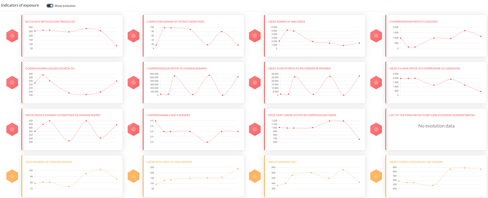
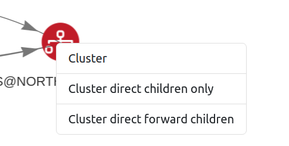
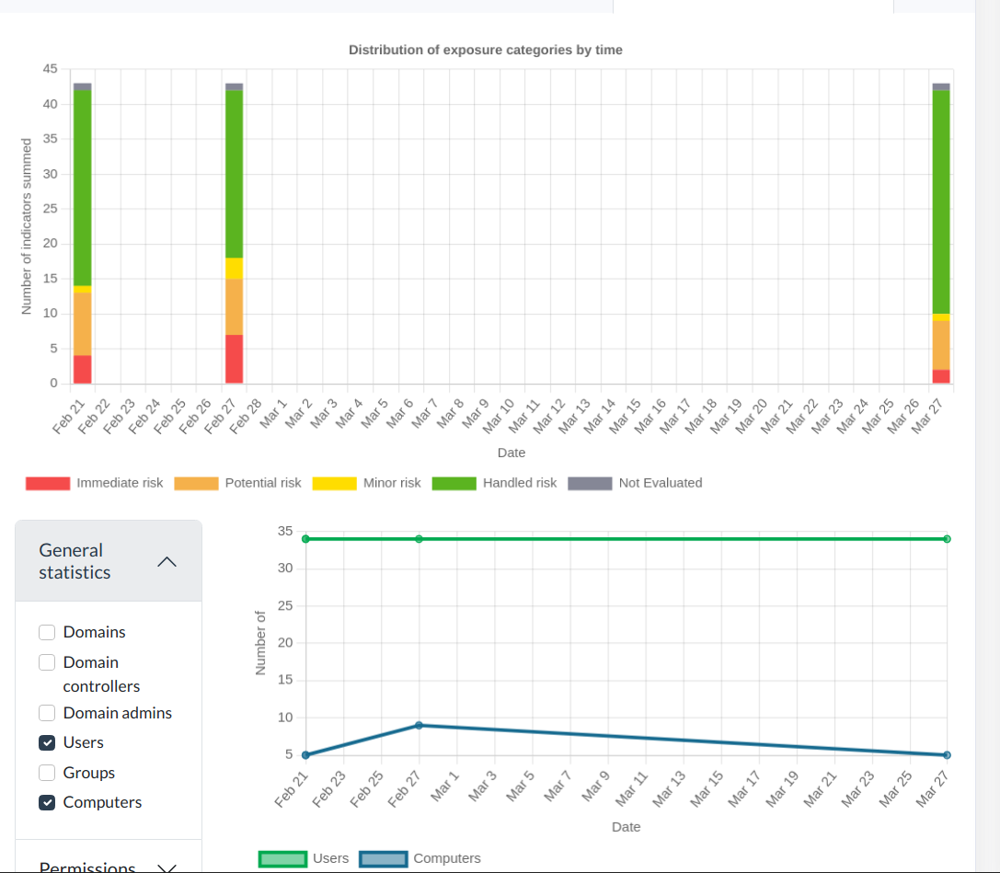
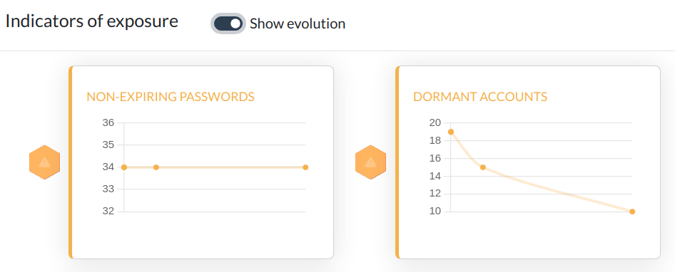
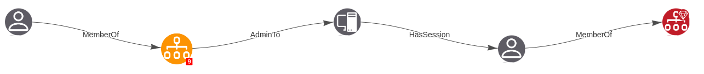

# ADMiner #

ADMiner is an Active Directory audit tool that leverages cypher queries to crunch data from the [BloodHound](https://github.com/BloodHoundAD/BloodHound) graph database (neo4j) and gives you a global overview of existing weaknesses through a web-based static report, including detailed listing, dynamic graphs, key indicators history, along with risk ratings.


You can also observe indicators over time to help measuring mitigation efficiency.


ADMiner was created and is maintained by the Mazars Cybersecurity Audit & Advisory team.

## Installation and setup ##

The easier way is to do the following command using `pipx`:
```shell
pipx install 'git+https://github.com/Mazars-Tech/AD_Miner.git'
```

Or, the same way using `pip`:
```shell
pip install 'git+https://github.com/Mazars-Tech/AD_Miner.git'
```

But remain careful and aware that doing this with pip will "polute" your packages.

## Prerequisites

To run AD Miner, you first need a neo4j database which contains the Active Directory objects:

 1. To extract the data from the domain, you can use tools like [SharpHound](https://github.com/BloodHoundAD/SharpHound), [RustHound](https://github.com/NH-RED-TEAM/RustHound) or [BloodHound.py](https://github.com/dirkjanm/BloodHound.py).
 2. Ingest the json files using [BloodHound](https://github.com/BloodHoundAD/BloodHound) or [BloodHound CE](https://github.com/SpecterOps/BloodHound). To automate this step, you can use [BloodHound Automation](https://github.com/Tanguy-Boisset/bloodhound-automation).
 3. By default, BloodHound creates a neo4j base accessible on port 7687.

## Usage ##

Run the tool:

    AD-miner [-h] [-b BOLT] [-u USERNAME] [-p PASSWORD] [-e EXTRACT_DATE] [-r RENEWAL_PASSWORD] [-a] [-c] [-l LEVEL] -cf CACHE_PREFIX [-ch NB_CHUNKS] [-co NB_CORES] [--rdp] [--evolution EVOLUTION] [--cluster CLUSTER]

Example:

    AD-miner -c -cf My_Report -u neo4j -p mypassword

To better handle large data sets, it is possible to enable multi-threading and also to use a cluster of neo4j databases, as shown in the following example (where server1 handles 32 threads and server2 handles 16) :

    AD-miner -c -cf My_Report -b bolt://server1:7687 -u neo4j -p mypassword  --cluster server1:7687:32,server2:7687:16

Options:

    -h, --help              Show this help message and exit
    -b, --bolt              Neo4j bolt connection (default: bolt://127.0.0.1:7687)
    -u, --username          Neo4j username (default : neo4j)
    -p, --password          Neo4j password (default : neo5j)
    -e, --extract_date      Extract date (e.g., 20220131). Default: last logon date
    -r, --renewal_password  Password renewal policy in days. Default: 90
    -c, --cache             Use local file for neo4j data
    -l, --level             Recursive level for path queries
    -cf, --cache_prefix     Cache file to use (in case of multiple company cache files)
    -ch, --nb_chunks        Number of chunks for parallel neo4j requests. Default : number of CPU
    -co, --nb_cores         Number of cores for parallel neo4j requests. Default : number of CPU
    --gpo_low               Perform a faster but incomplete query for GPO
    --rdp                   Include the CanRDP edge in graphs
    --evolution             Evolution over time : location of json data files. ex : '../../tests/'
    --cluster               Nodes of the cluster to run parallel neo4j queries. ex : host1:port1:nCore1,host2:port2:nCore2,...

In the graph pages, you can right-click on the graph nodes to cluster them or to open the cluster.

<p align="center">
    
</p>

If you have azure, an azure-specific Dashbord appears automatically (still under development)

## Evolution ##

If you have multiple AD-Miner reports over time, you can easily track the evolution with the `--evolution` argument: each AD-Miner report generates a JSON data file alongside the `index.html` file. You just need to gather these different JSON files into a single folder and specify the path to that folder after the `--evolution` argument.

A tab called 'Evolution over time'  then appears on the main page.

<p align="center">
    
</p>

Also, views by categories 'permissions,' 'passwords,' 'kerberos' also allow you to track changes over time.

<p align="center">
    
</p>

## Smartest paths ##

AD Miner can compute paths based on their actual exploitability. Indeed, sometimes the shortest path is difficult to exploit (here because of the `ExecuteDCOM` before the `HasSession`).

<p align="center">
    
</p>

While a longer but simpler path exists (here with `MemberOf` and `AdminTo` instead of `ExecuteDCOM`).

<p align="center">
    
</p>

AD Miner automatically switches to smartest path mode when your neo4j database has the Graph Data Science plugin installed (https://neo4j.com/docs/graph-data-science/current/).
The easiest way to install this plugin is to define an environment variable in your neo4j docker: ```NEO4J_PLUGINS=["graph-data-science"]```

List of controls that currently support full graph coverage and smartest paths:
* objects_to_domain_admin

## Discord ##

You can join the AD Miner Discord : https://discord.com/invite/5Hpj4Gs5SS

Feel free to share any thoughts, feedback or issue that you can come up with regarding AD Miner as it's still evolving 🛠️

## Implemented controls ##

The following provides a list controls that have already been implemented in AD Miner :

| | | |
|---|---|---|
|Dormant accounts|Tier 0 sessions violation|Control path cross domain from DA to DA|
|Ghost computers|Machine accounts with admin privs|Control paths to GPOs|
|Accounts without password expiration|Obsolete OS|Control paths to servers|
|Accounts with old passwords|Inadequate number of domain admins|Control paths to OU|
|Accounts with clear-text passwords|RDP access|Control paths to GMSA passwords|
|Kerberoastable accounts|Domain functional level|Control path to AdminSDHolder container|
|AS-REP Roastable accounts|Users with admin privs|Users with path to DNS Admins|
|Accounts with SID history|Machine accounts with high privs|ACL anomalies on group objects|
|LAPS status|Non tier 0 with DCSync capabilities|Objects with path to an Operator Group|
|LAPS access|Unconstrained delegations|ADCS local admin privs|
|KRBTGT password age|Constrained delegations|Empty groups/OU|
|DC Shadow to DA|Role-based constrained delegations|Guest accounts|
|DC Shadow to all|Control paths to domain admins|Pre-Windows 2000 group|
|Admincount relevance|Protected Users|Primary Group ID|


## Contributing ##

Check out how to contribute [here](CONTRIBUTING.md).
